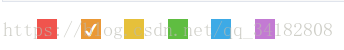
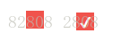
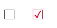

# 使用css修改input框中checkbox的样式


## 1. input + label


**概述**

在页面设计时，我们经常使用input复选框。由于界面设计的需要，我们需要修改复选框的样式，使得界面更美观或者适应新的需求。由于CheckBox伪类修改比较复杂，通常修改的方式有两种，一个是链入图片，另一个是使用纯css的方法进行修改。链入图片的设计方式比较简单，但是需要预先设计或者下载图片，比较麻烦。纯css的方法，只需要在css文件中编写代码，个人觉得比较方便，因此，本文使用该方式对input中的CheckBox进行设置。


**实现效果**
  
设计时，希望达到以下效果，如图所示，每个带颜色的方块都是有input框组成，每个input框的背景色不同，并且，再点击时，只能同时选中一个input框（实现效果相当于radio）。




**实现步骤**

1） 在设计时，我们使用<lable>标签的for属性，绑定到input标签上（for属性应对应到input标签中的id）。在jsp代码中设计如下所示：

```html
<input id="color-input-red" class="radio-input" type="checkbox" name="color-input-red" value="#f0544d" />
<label  for="color-input-red"></label >
```

2) 在css文件中设置lable标签的显示样式：

```css
/*lable标签的大小、位置、背景颜色更改，在css选择时，“+”代表相邻元素，即当前元素的下一元素*/
#color-input-red +label{
    display: block;
    width: 20px;
    height: 20px;
    cursor: pointer;
    position: absolute;
    top: 2px;
    left: 15px;
    background: rgba(240, 84, 77, 1);;
}
 
/*当input框为选中状态时，lable标签的样式，其中在css选择时，“：”表示当前input框的值，即checked；
      该部分主要对显示的“对号”的大限居中方式，显示颜色进行了设置*/
#color-input-red:checked +label::before{
    display: block;
    content: "\2714";
    text-align: center;
    font-size: 16px;
    color: white;
}
```

其中里面的content表示在方框中显示的内容，"\2714"、"\2713"都表示对号，只是显示的瘦弱程度不同，大家可以在调试的时候，选择其中一个。对于css中的内容，我们可以根据需要设置为自己的内容。

3) 在css中将原先的input[type=checkbox]的内容进行隐藏。
   
```css
input[type=checkbox]{
	visibility: hidden;
}
```

最终的显示效果如下：




转自：[使用css修改input框中checkbox的样式](https://blog.csdn.net/qq_34182808/article/details/79992465)


## 2. 原生复选框 input[type=“checkbox“] 样式修改

**概述**

有的时候在编辑页面的时候会出现需要修改原生复选框样式的需求，那么，这里有一个范本，可以参照修改

```css
input[type="checkbox"] {
  width: 20px;
  height: 20px;
  display: inline-block;
  text-align: center;
  vertical-align: middle;
  line-height: 18px;
  position: relative;
}
input[type="checkbox"]::before {
  content: "";
  position: absolute;
  top: 0;
  left: 0;
  background: #fff;
  width: 100%;
  height: 100%;
  border: 1px solid #d9d9d9;
}
input[type="checkbox"]:checked::before {
  content: "\2713";
  background-color: #fff;
  position: absolute;
  top: 0;
  left: 0;
  width: 100%;
  border: 1px solid #e50232;
  color: #e50232;
  font-size: 20px;
  font-weight: bold;
}
```

显示效果如下：




转自：[原生复选框 input type="checkbox" 样式修改](https://blog.csdn.net/lwx931449660/article/details/108539587)
