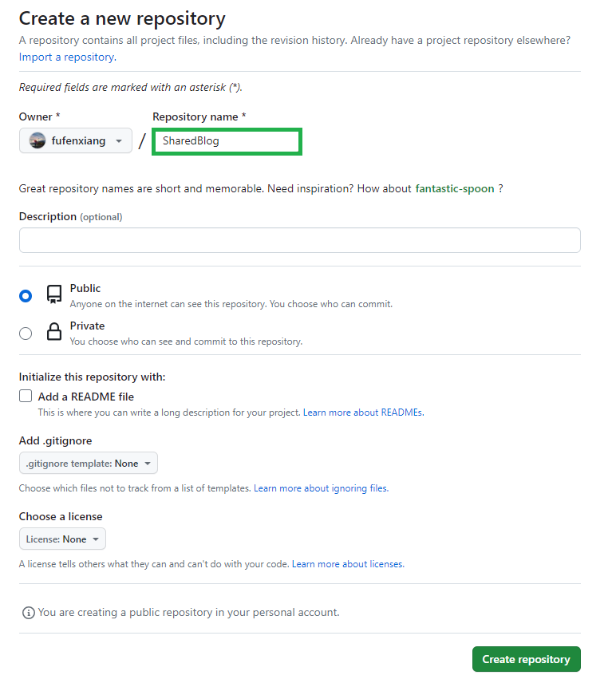
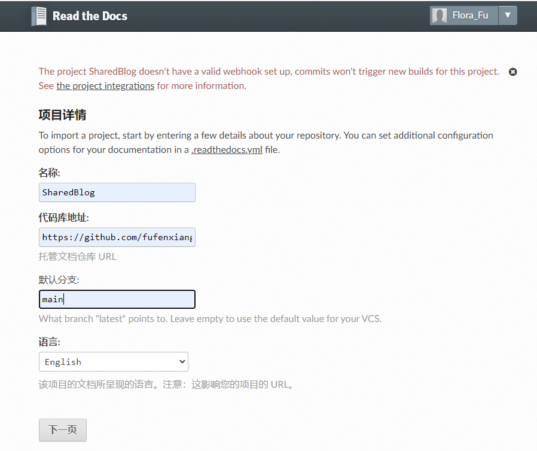
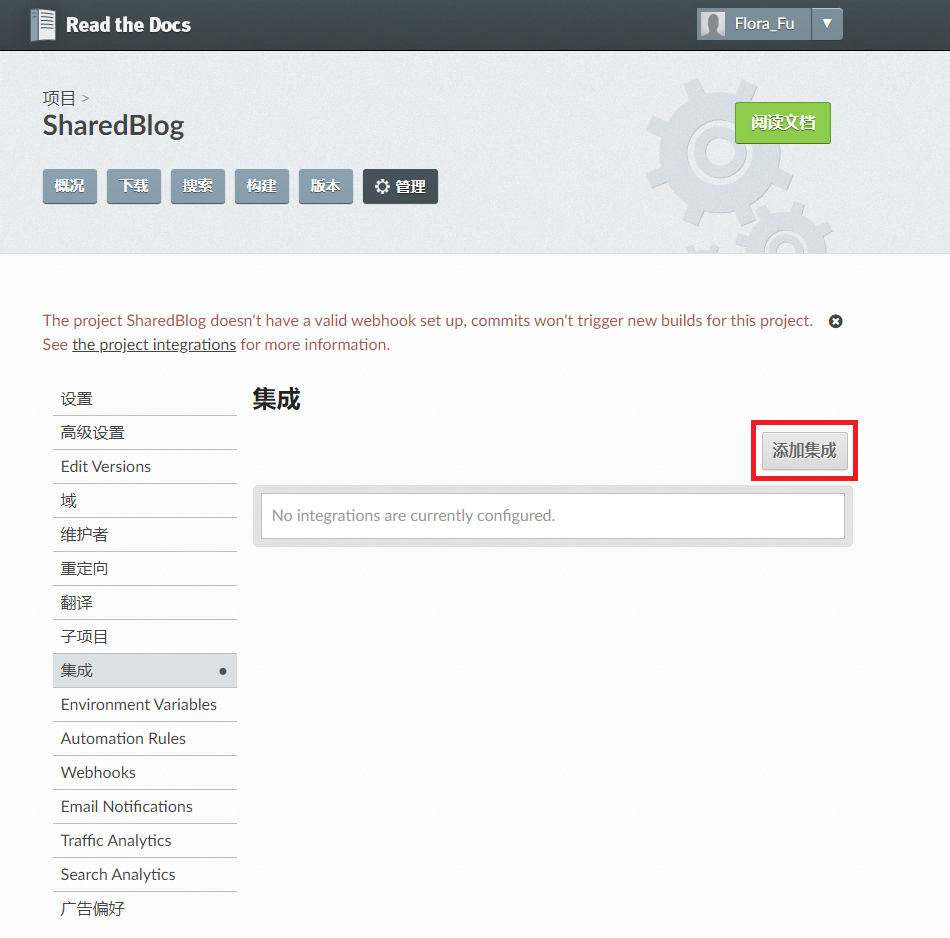
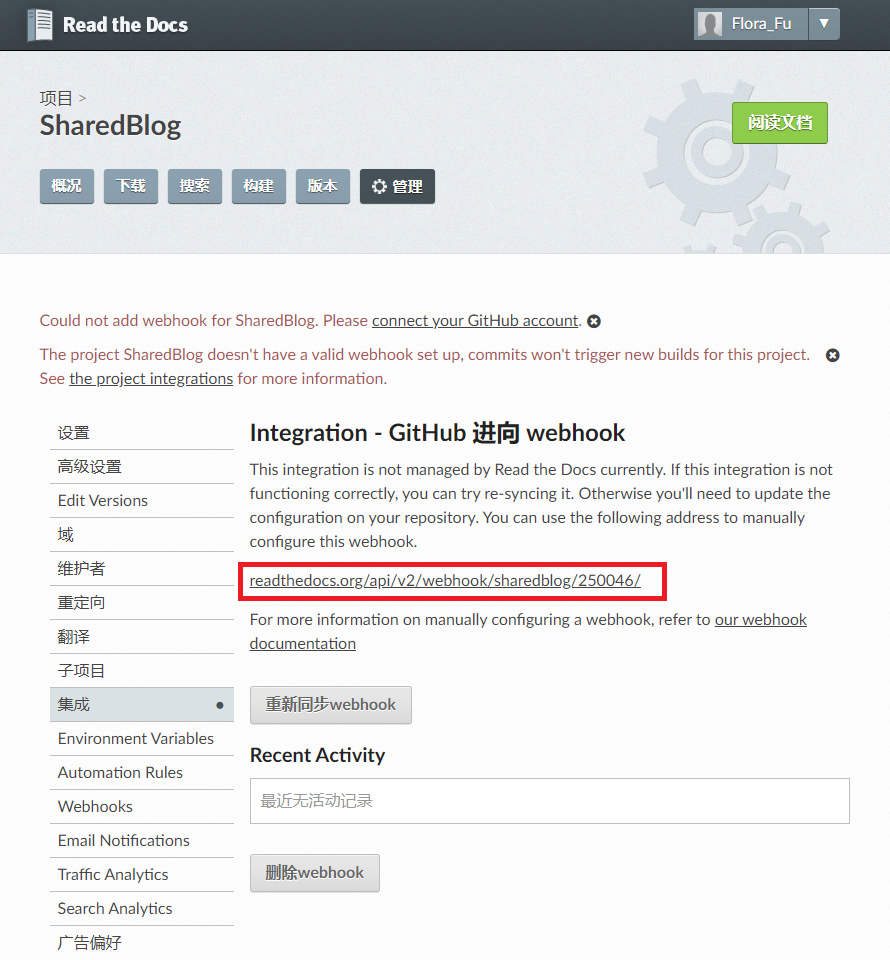
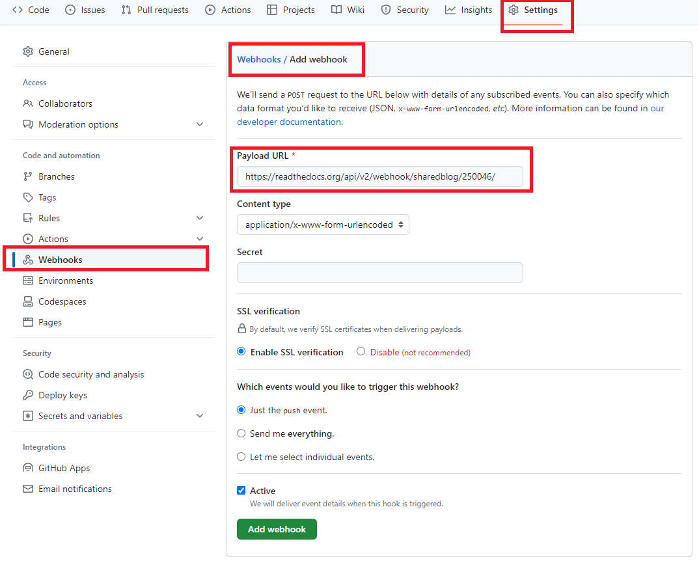

# Sphinx 文档托管

## 1. 背景知识

对于文档，一般有以下基本要求：
- 只维护一份，其他地方自动同步更新
- 可以根据代码注释，动态更新维护相应的API文档
- 支持检索
- 多版本之间的API接口动态查看

要满足上述需求，Sphinx + Github + ReadTheDocs 是一个很好的选择。


## 2. 上传 GitHub

经过 "Sphinx 快速开始" 后，可以本地生成Sphinx渲染之后得到的html文档，但是只能本地查看。我们需要将其托管到Github中，便于后续Read the docs部署。

**(1) 首先在 GitHub 上创建一个 SharedBlog 仓库**



**(2) 添加 README.md 和 .gitignore 文件**

在本地 SharedBlog 目录中添加 README.md 和 .gitignore 文件，并在 .gitignore 文件中写入下面一行。

```
build/
```
表示不跟踪 build 目录，因为我们后面将使用 Read the Docs 进行文档的构建和托管。

**(3) 生成 requirements.txt文件**

在本地 SharedBlog 项目根目录下运行命令生成 requirements.txt文件，文件记录了所有当前虚拟环境安装的依赖包以及版本

```
pip3 freeze > requirements.txt
```

requirements.txt文件用于后续 readthedocs 网站构建时安装环境依赖。

**(4) 代码提交**

依次执行如下命令将你的文档代码Push到Github即可。

```
# 本地建立git仓库
# cd到你的本地项目根目录下，执行git命令
git init

# 将项目的所有文件添加到仓库中
git add .
# 如果想添加某个特定的文件，只需把.换成特定的文件名即可'

# 将add的文件commit到仓库
git commit -m "first commit"

# 将本地的仓库关联到github上
git remote add origin git@github.com:fufenxiang/SharedBlog.git

# 上传github之前，要先pull一下
git pull origin main

# 如果有错误提示 : fatal: refusing to merge unrelated histories
# 在进行git pull 时，添加一个可选项（在更高版本的保护机制）
git pull origin main --allow-unrelated-histories

# 上传代码到github远程仓库
git push -u origin main

```

执行完后，如果没有异常，等待执行完就上传成功了，中间可能会让你输入Username和Password，你只要输入github的账号和密码就行了

注意：如果提交代码出现问题，可以先同步远程残仓库代码，合入本地修改后再提交。


## 3. 网页托管: 连接Readthedocs和Github

**(1) 创建 .readthedocs.yml 配置文件**

代码上传至 Github 仓库之后，需要在GitHub仓库根目录下,增加一个名称为 .readthedocs.yml 的配置文件

```yaml
# .readthedocs.yml
# Read the Docs configuration file
# See https://docs.readthedocs.io/en/stable/config-file/v2.html for details

# Required
version: 2

# Build documentation in the docs/ directory with Sphinx
sphinx:
   builder: html
   configuration: source/conf.py
   fail_on_warning: true

# Optionally build your docs in additional formats such as PDF
formats:
   - pdf

# Optionally set the version of Python and requirements required to build your docs
python:
   version: 3.8
   install:
   - requirements: requirements.txt
```

**(2) ReadTheDocs 托管以及自动更新**

现在，所有文件已经提交到了你的 github 仓库，接下来需要把github和Readthedocs连接起来，连接过程分两种情况：

- 个人仓库。很简单，在你登录readthedocs时，直接选择sign in with github就可以了。
- 多人合作的仓库。需要Webhooks（钩子）才能实现同步，下面着重提一下 **Webhooks**。


首先，在 Read the Docs 网站 [https://readthedocs.org/](https://readthedocs.org/) 用 github 或者用邮箱注册账号并登录，选择 
<font color='red'> Import A Project >> 手动导入 >> 填写代码仓库地址等 >> 下一页 </font>。




然后就是它自动进行同步了，但是，因为没有webhooks，同步不会成功。

接下来，找到 <font color='red'>project settings >> Integrations </font> 你会进入到下图的页面：




点击 <font color='red'>添加集成 >> 选择 GitHub 进向 webhook >> 添加集成 </font>




将红色框住的地址复制，粘贴到github的Webhooks中。操作过程是：

<font color='red'>打开代码仓库 >> Settings >> Webhooks >> Add webhooks >> Payload URL </font>，如下图：




接下来你就可以向这个仓库添加代码，由于readthedocs和github用户间已建立关联，该项目的url地址即刻被github访问到（这里其实readthedocs作为server被github执行POST请求其代码更新），然后Readthedocs就会有相应的更新，。

这样，一个多人协同办公的技术文档就可以搭建起来了。


**(3) 构建文档**

ReadTheDocs 首次导入项目之后会自动触发文档构建，如果需要新的构建，点击 "构建" 按钮即可。


如果构建失败，查看失败Log修改 .readthedocs.yml 或 requirements.txt 文件等。

一般容易出现的错误包括：

- .readthedocs.yml 中的 Python 版本问题，最大支持 Python3.8;
- requirements.txt 文件中的依赖包版本问题，有的依赖包版本找不到，删除版本，仅保留依赖包名称即可。

requirements.txt 实例：

```
alabaster==0.7.13
Babel==2.12.1
certifi==2023.7.22
charset-normalizer==3.2.0
colorama==0.4.6
commonmark==0.9.1
docutils==0.18.1
idna==3.4
imagesize==1.4.1
Jinja2==3.1.2
livereload==2.6.3
Markdown==3.4.4
MarkupSafe==2.1.3
packaging==23.1
Pygments==2.16.1
recommonmark==0.7.1
requests==2.31.0
six==1.16.0
snowballstemmer==2.2.0
Sphinx
sphinx-autobuild==2021.3.14
sphinx-markdown-tables==0.0.17
sphinx-rtd-theme==1.3.0
sphinxcontrib-applehelp
sphinxcontrib-devhelp
sphinxcontrib-htmlhelp
sphinxcontrib-jquery
sphinxcontrib-jsmath
sphinxcontrib-qthelp
sphinxcontrib-serializinghtml
tornado==6.3.3
urllib3==2.0.4
```


## 参考

   [1] [Read the Docs 从懵逼到入门](https://blog.csdn.net/lu_embedded/article/details/109006380)

   [2] [使用sphinx+markdown+readthedocs+github来编写文档](https://www.cnblogs.com/jonnyan/p/14207711.html)

   [3] [Readthedocs+Github搭建文档(webhook)](https://it.cha138.com/shida/show-210139.html)

   [4] [使用readthedocs+github+sphinx+reST构建文档(webhook)](https://www.jianshu.com/p/312c45631586)

   [5] [Github + Sphinx+Read the docs 实战入门指南（二）](https://blog.csdn.net/shiwanghualuo/article/details/129911565)


