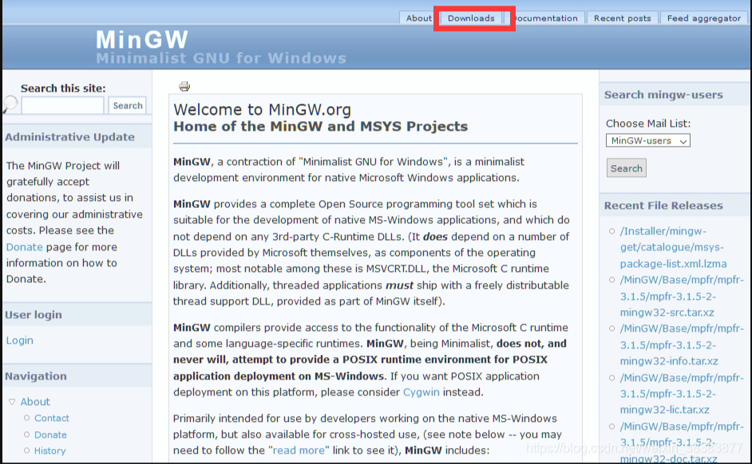
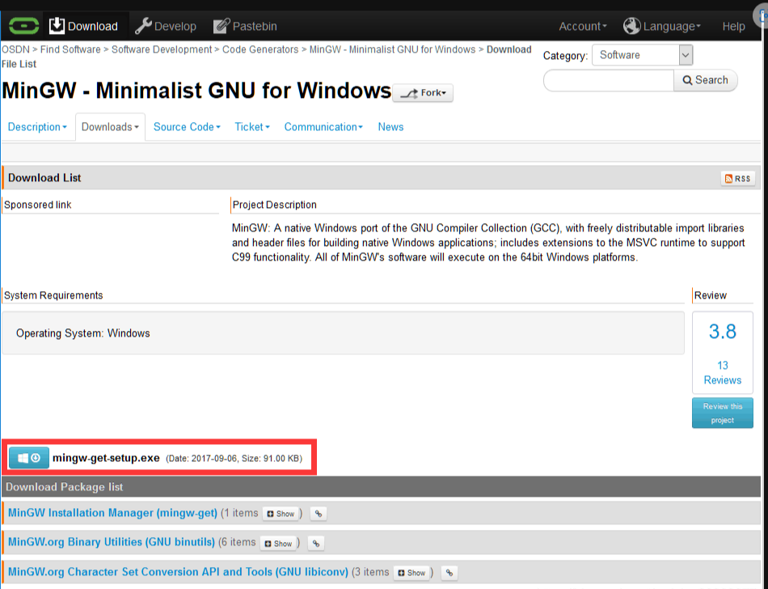
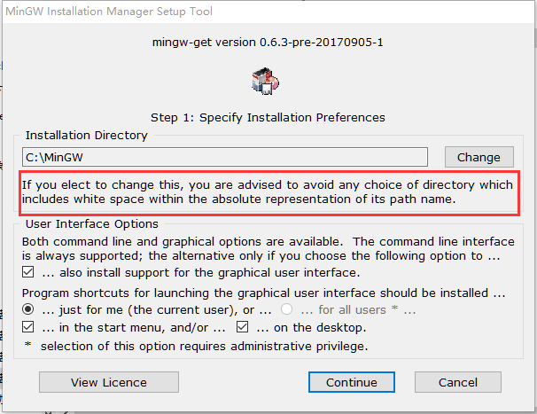
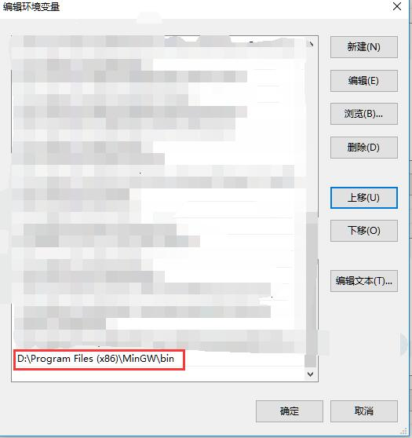
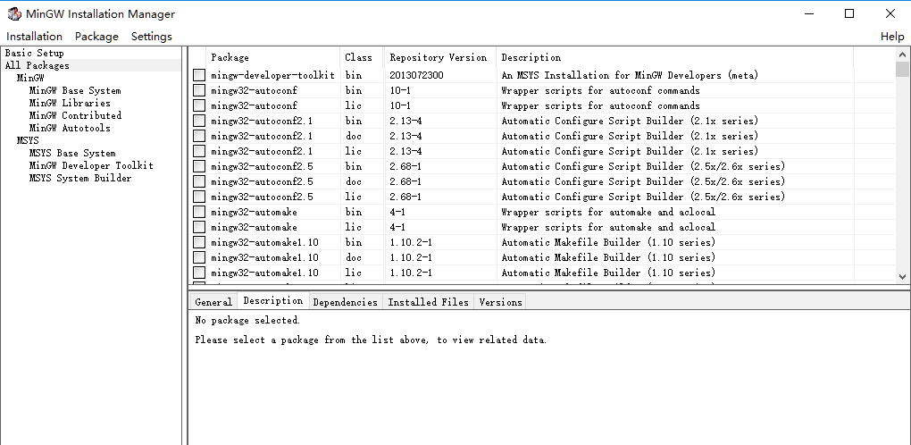
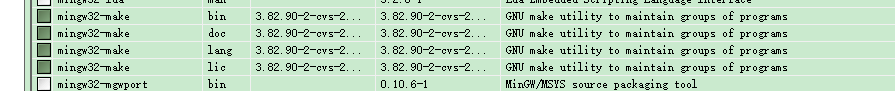
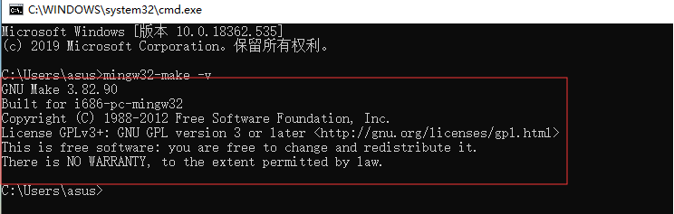
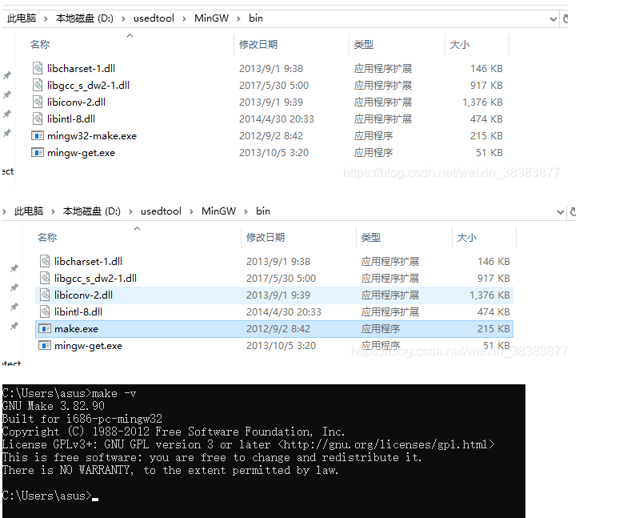

# Windows 安装 Make

## 1. Make 简介
    Make 是一种流行的构建工具，常用于将源代码转换成可执行文件或者其他形式的输出文件(如库文件、文档等)。Make 可以自动化地执行编译、链接等一系列操作，提高开发效率。

   - Make 使用 **Makefile 文件** 描述项目的构建过程，其中包含了源文件、目标文件以及编译和链接的命令等信息。Makefile 按照一定的规则解析，将源码和构建过程相互关联起来，执行具体的构建操作，生成目标文件或可执行文件。

   - Make 工具的优势在于它可以识别哪些文件被修改了，只编译修改过的部分，以提高构建速度。此外，Make 工具还支持基于条件的编译，也就是预处理器(preprocessor)功能，可以生成不同的输出文件用于不同的平台或不同的运行环境。

   - Make 工具具有很好的 **跨平台性**，可以在 Unix/Linux、Windows、Mac 等多种操作系统上使用，并且可以与多种编程语言搭配使用，如 C、C++、Java 等。

    总之，Make 工具是一种非常实用的构建工具，可以帮助开发者高效地管理和构建项目。


## 2. 下载 MinGWMinGW 安装包

   在Windows中没有make，但是可以通过安装MinGW或者MinGW-w64，得到make。

   下载 MinGWMinGW，官网下载：[http://www.mingw.org](http://www.mingw.org)，点击右上角Downloads：

   

   或者网盘下载：链接：[https://pan.baidu.com/s/1vQVKycK1TKVsnLV_OMgiCg](https://pan.baidu.com/s/1vQVKycK1TKVsnLV_OMgiCg) 提取码：bbhl。

   点击下载 mingw-get-setup.exe:

   


## 3. 安装 MinGWMinGW

   直接默认安装就好了，如果不想安装在C盘，修改的安装路径最好不要有空格。

   

   安装完之后将MinGW\bin路径添加到系统环境变量里：
  
   此电脑 -> 右键 "属性" -> 高级系统设置 -> 高级 -> 环境变量 -> 系统环境变量下找到 "Path"，双击 新建 -> 把MinGW\bin的路径复制进去 -> 然后一路点"确定"退出。

    


## 4. 安装 Make Package

   **方法一(推荐)**：
   1. Win+R 打开运行，输入cmd回车
   2. 安装gcc：输入 mingw32-get install gcc 回车
   3. 安装g++：输入 mingw32-get install g++ 回车
   4. 安装gdb：输入 mingw32-get install gdb 回车
   5. 安装make：输入 mingw32-get install mingw32-make 回车

   **注意：** 安装命令中 mingw32-get 也可能为 mingw-get，根据你自己安装路径中的 mingw 版本而定。

   **方法二**:
   1. Win+R 打开运行，输入cmd回车
   2. 输入 mingw32-get 回车
   3. 显示如下界面(如果出错的话，应该是环境变量没配好，要重新配置一下)：

    

   选择你想要安装的Package，点击前面的选择框，点击 Mark for Installation，都选择好后，点击左上角的 Installation，点击 Apply Changes 就可以了。安装make命令，选择：

    


## 5. 安装测试

   在cmd里输入：mingw32-make -v，如果出现如下信息，就说明安装成功了。
   
    

   如果你每次make的时候不想输 mingw32-make 这么长, 可以到 MinGW\bin 下把 mingw32-make.exe 重命名为 make.exe 就行了。

    


## 6. Make 常用命令

```
make：执行默认的或指定的目标(target)。

make clean：清除所有生成的文件(.o,obj,exe,lib等)。

make install：安装可执行文件或库文件到系统目录。

make uninstall：从系统中卸载已安装的可执行文件或库文件。

make distclean：删除配置文件和Makefile，恢复源代码目录的状态。

make package：将生成的代码打包成可发布的压缩包。

make test：运行单元测试或集成测试。

make help：显示Makefile中定义的所有目标及其说明信息。

make debug：开启调试模式，可以用于调试Makefile。

make dep：将源代码中的依赖关系写入Makefile，以便于自动化编译

```


## 7. Makefile 书写格式

```
GOPATH:=$(shell go env GOPATH)
.PHONY: init
init:
    go install google.golang.org/protobuf/cmd/protoc-gen-go@latest
    go install github.com/micro/micro/v3/cmd/protoc-gen-micro@latest
    go install github.com/micro/micro/v3/cmd/protoc-gen-openapi@latest

.PHONY: api
api:
    protoc --openapi_out=. --proto_path=. proto/microProject.proto

.PHONY: proto
proto:
    protoc --proto_path=. --micro_out=. --go_out=:. proto/microProject.proto
    
.PHONY: build
build:
    go build -o microProject *.go

.PHONY: test
test:
    go test -v ./... -cover

.PHONY: docker
docker:
    docker build . -t microProject:latest

```

   **PHONY** 是 Makefile 中的一个关键字，在 Makefile 的规则中表示伪目标，即不与任何文件名相关联的目标。使用 PHONY 关键字声明的目标，其中不包含真正的文件依赖，就算文件名与伪目标同名也不会被当做文件处理。

   使用 PHONY 的作用是在将来对于相应的文件名，不会产生任何干扰，而且它可以帮助我们避免与系统中的文件或目录名称发生冲突。通常情况下，PHONY 目标都是一些命令，没有实际的文件产生，而是进行代码编译、测试、清理等等操作。

   举个例子，比如我们在 Makefile 中定义了一个 clean 目标用于删除所有生成的二进制文件，那么我们可以使用 PHONY 将其声明为伪目标，这样一个名为 clean 的文件就不会在出现时被误认为是编译生成的文件，从而避免了无意间的误删。声明的语法格式如下：

```
.PHONY: clean
 
clean:
    del *.exe

```

   这里我们可以看到，clean 目标被声明为伪目标，在规则的下一行中，使用 del 命令删除所有 .exe 后缀的文件。


## 参考

   [1] [Win10安装gcc、g++、make](https://www.cnblogs.com/raina/p/10656106.html)

   [2] [windows环境安装make命令](https://blog.csdn.net/heiwa110/article/details/130696242)