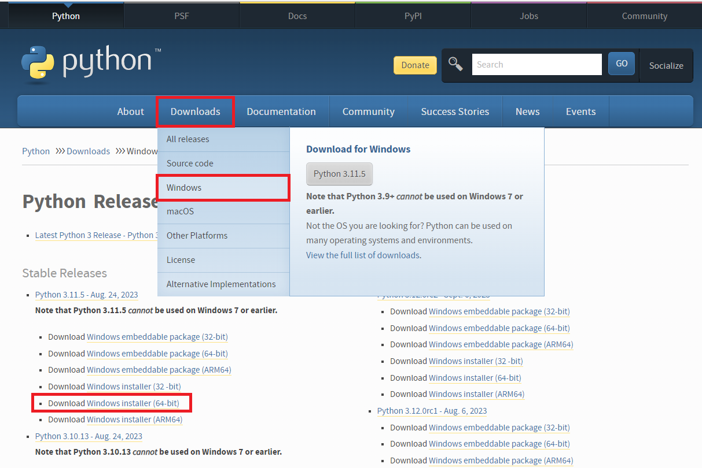
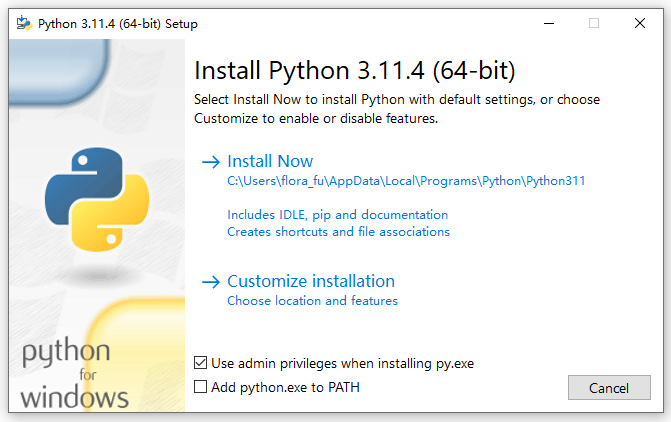
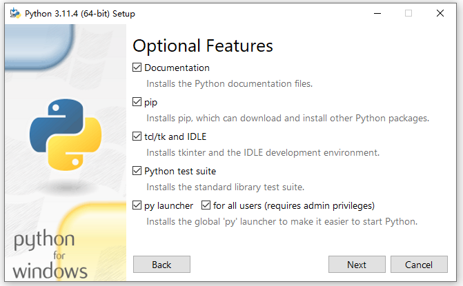
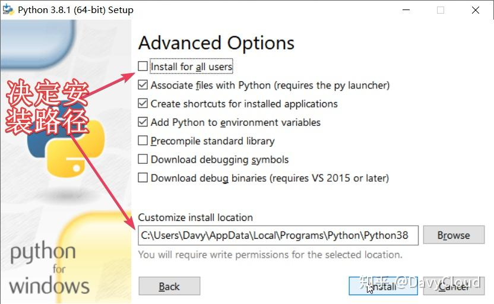

# Windows 安装 Python

## 1. 下载 Python 安装包

   打开 Pyhon 官网 [https://www.python.org/](https://www.python.org/)，根据你的系统下载相应的安装包，如：

   

   这里不用过于纠结 Python 的版本，即使以后因为特殊情况，需要某一个特定的 Python 版本，重新安装一个即可。

## 2. 开始安装

   几乎所有的 Python 安装教程都会强调，勾选 Add Python to PATH 的选项，但是问题来了:

   

   这个选项既然如此重要，为什么安装包不把它作为默认勾选状态呢？

   **PATH 的作用**

   首先环境变量 PATH 的值是一堆路径的列表，因为环境变量的值只支持字符串，所以使用分号（;）连接字符串的形式。Windows 10 的体验不错，提供了对话框式的列表操作。 Windows 7 还需要编辑整个字符串，当我们在命令行中敲命令的时候，操作系统就是去这些路径下搜索有没有可执行程序能对得上号。只要找到了，就执行；没找到，就报错。找的时候是从前往后按顺序的，一旦找到，后面就不继续找了。

   因此，为了能让命令行找到 python，必须要把 Python 的安装路径也加入到 PATH 变量中，这一点毫无疑问。

   问题在于 Python 并不是永远只安装一个。有些时候我们必须安装多个 Python 版本。

   **多 Python 版本并存的痛点**

   比如说，虽然今天我们安装了最新的 Python 3.8 版本，但是可能我需要用到的某个软件还没支持这么新，甚至有的企业里的软件可能还只支持 Python 2.7。

   安装多个 Python 版本，只要安装到不同的目录，它们彼此是不会产生什么冲突的，但是加入到 PATH 的待遇却只有一个能享受。那么其它没加入到 PATH 中的 Python 就变得使用没那么方便了。

   在 Linux 系统中，这个很好解决，而在 Windows 系统下就比较麻烦，所以这才有了 launcher，也就是 Python 启动器 这么个东西。

   Python 启动器也是个程序，py.exe，直接在命令行中敲 py 就能调用。它能够方便地管理所有安装过的 Python 版本，轻松启动不同版本的 Python 解释器，不管其有没有加入到 PATH 中。

   偷懒的人勾选完 Add Python to PATH 就可以直接点击 Install now 开始安装了。出于介绍的目的，或者你想把 Python 安装到自定义目录，可以选择 自定义安装（Customize installation）。

   自定义安装有 2 个对话框选择，第一个默认都是勾选上的，每个选项是啥意思介绍如下：

   

   - Documentation 离线的 .chm 格式文档，必须保留。英文还 OK 的小伙伴可以直接看这份文档，比所有书都靠谱。看英文有压力的，平时随时查查标准库模块用法什么的是极好的。
   - pip Python 包下载工具，必须保留。（想找虐的随意）
   - tcl/tk and IDLE ，说来话长，保留就对了。
   - Python test suite，这个可以没有，当然留下来也没关系。
   - py launcher，前面介绍过了。
   - 这里额外注意的是 for all user 选项，可以选择是否对所有用户安装。如果对所有用户安装，则需要 administrator 的权限。

   第 2 个对话框是高级选项:

   

   - Install for all user，是否对所有人安装，如果是，需要 administrator 的权限，并且安装路径会有所不同。
   - 关联文件到 Python，这个保持原样即可。它就是把 .py 文件和 python 程序关联起来，这样双击 .py 文件的时候，自动就用 python 去执行了。
   - 创建快捷方式，保持原样即可。
   - 添加 Python 到环境变量，第 2 次修改的机会
   - 预编译标准库，一次性的把标准库的 .py 都预编译成 .pyc，没什么必要，会多花费安装时间，不选
   - 两个 download debug xxx ，不知道哪里会用到，都不选
   - 最下面是指定安装路径，可保持默认或自定义。如果取消勾选为所有人安装，则默认安装的路径会比较深，这个看上去有点不舒服，但是绝大多数情况下我们都不会直接造访该目录，所以不会有什么影响。我个人的推荐操作是不选择对所有用户安装，这样如果想使用多个用户，每个用户有自己选择的自由。

   ## 3. 安装后的基本测试

   安装完成后，新打开一个命令行窗口，win + r，然后输入 cmd:
   
   注意，必须重新打开，在安装 Python 前已打开的命令行不会自动更新环境变量。

   依次执行下面的命令:

   ```
   # 注意，-0 后面是数字 0，不是字母 o
   py -0
   # or
   py --list

   ```
   这就是调用 Python 启动器，它显示出系统中已安装的 Python 版本。

   ```
   python --version

   ```
   这是直接调用 Python 解释器，打印出它的版本。

   ```
   pip --version

   ```
   这是调用 pip，打印出它的版本。

   为什么要测试这 3 个命令，因为它们分别安装在了不同的位置，都工作正常了，就证明安装没有问题了。

   想要了解更多细节，可以查看 PATH 环境变量。


   ## 4. 安装目录详情

   先来看 **Python 的安装路径**，它是包含 python.exe 的目录。路径下各目录/文件的作用：

   - DLLs，静态链接库，里面是一些 .dll 和 .pyd 文件，一般不会直接和这个目录打交道
   - Doc，文档，里面就是一个 python381.chm，快捷方式里包含了该文档路径，所以平常不会直接访问
   - include，头文件，基本上不会用到
   - Lib，这个目录最最重要，几乎所有的标准库源码都在这里面了，大部分平常都不会去动它们，除了其中一个子目录：
   - site-packages 后续安装的第三方模块和包都会出现在这里，所以偶尔出现问题，我们会造访这里。
   - libs，几乎不会直接用到，注意和 Lib 区分开。（因为 Windows 系统路径不区分大小写，所以 Lib 实际会展示成 lib ）
   - Scripts，后续安装的第三方包如果提供了命令，可执行文件就会出现在这里。例如 pip.exe 就是在此目录下，而 Lib 目录下保存的是 pip 的源码。
   - tcl，仍然是说来话长，略过
   - Tools，自带的一些 Python 脚本，包括一些 demo，其中有些可以作为学习参考。

   安装 Python 后在开始菜单会多出来 4 个快捷方式，一般很少用，做一个简单的介绍:

   - IDLE，用来启动 IDLE ，以后再详细介绍它。
   - Python Module Docs (64-bit)，点击会自动启动一个本地 web 服务，然后自动打开包含模块文档的网页，样式非常古老，而且其中的内容都包含在下面的文档文件中了，所以基本没人会用这个。
   - Python Manuals (64-bit)，点击打开文档
   - Python (64-bit)，点击用来启动 Python 解释器。用这种方法启动解释器，退出后就整个黑窗口都消失了，打印的信息也都看不到了，所以我们一般是先启动命令行，再从命令行内启动 Python，这样即使解释器退出了，也能看到刚才程序执行的结果。


   ## 参考

   [1] [Windows 系统安装 Python 3.8 详解](https://zhuanlan.zhihu.com/p/104537494)
