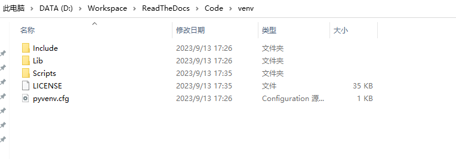

# Sphinx 快速开始

## 1. 背景知识

 1. **ReadtheDocs** 

    Read the Docs 是一个基于 Sphinx 的免费文档托管项目。该项目在 2010 年由 Eric Holscher、Bobby Grace 和 Charles Leifer 共同发起。2011年3月，Python 软件基金会曾给 Read the Docs 项目资助 840 美元，作为一年的服务器托管费用。此后，受到越来越多开源社区和开发者的关注，2017年11月，Linux Mint 宣布将所有文档转移到 Read the Docs，目前 Read the Docs 已经托管了超过 90000 份文档。

    Read the Docs官方网站：[https://readthedocs.org/](https://readthedocs.org/)


 2. **Sphinx**

    Sphinx 是一个基于 Python 的文档生成项目。最早只是用来生成 Python 的项目文档，使用 reStructuredText 格式。但随着 Sphinx 项目的逐渐完善，目前已发展成为一个大众可用的框架，很多非 Python 的项目也采用 Sphinx 作为文档写作工具，甚至完全可以用 Sphinx 来写书。

    Sphinx 是 Python 社区编写和使用的文档构建工具，由 Georg Brandl 在 BSD 许可证下开发，它可以令人轻松的撰写出清晰且优美的文档。除了天然支持 Python 项目以外，Sphinx 对 C/C++ 项目也有很好的支持，并在不断增加对其它开发语言的支持，有需要的小伙伴可以持续关注。

    Sphinx 网站：[http://sphinx-doc.org/](http://sphinx-doc.org/)

    Sphinx 使用手册：[https://zh-sphinx-doc.readthedocs.io/en/latest/index.html](https://zh-sphinx-doc.readthedocs.io/en/latest/index.html)


 3. **reStructuredText**

    reStructuredText 是一种轻量级标记语言。它是 Python Doc-SIG（Documentation Special Interest Group）的 Docutils 项目的一部分，旨在为 Python 创建一组类似于 Java 的 Javadoc 或 Perl 的 Plain Old Documentation（pod）的工具。Docutils 可以从 Python 程序中提取注释和信息，并将它们格式化为各种形式的程序文档。

    值得注意的是，reStructuredText 是一个单词，不是两个，也不是三个。可以简写为 RST、ReST 或 reST，作为一种用于文本数据的文件格式，通常采用 .rst 作为文件后缀。

    前面提到，Sphinx 使用 reST 作为标记语言。实际上，reST 与 Markdown 非常相似，都是轻量级标记语言。由于设计初衷不同，reST 的语法更为复杂一些。

    Markdown 的目标很简单，就是为了更简单地写 HTML，完成 text-to-HTML 的任务。而 reST 的目标是，建立一套标准文本结构化格式用以将文档转化为有用的数据格式（简单来说，就是要实现一套简单、直观、明确、原文本可阅读的，且可以转化为其他格式的文档标记语言）。显然，reST 的目标更大一些。

    reStructuredText 网站：[http://docutils.sf.net/rst.html](http://docutils.sf.net/rst.html)

## 2. 环境搭建

### 2.1 基础环境

首先需要安装 Python3、Git、Make 等基础软件， 以 Windows 系统为例，可参考前述章节安装。


### 2.2 搭建虚拟环境

**什么是python的虚拟环境？**

所谓的python虚拟环境，我们可以类比虚拟机的概念，每一个python虚拟环境都包含基本的python库，是能够独立运行的执行空间。在虚拟环境里可以下载第三方包、创建项目、写代码等等。因为虚拟环境之间互不干扰，一旦进入某个虚拟环境后，下载、安装的包，仅仅只会安装到该虚拟环境里。

**为什么需要python的虚拟环境？**

python虚拟环境的主要作用就是环境隔离，如果开发一个项目时，所需要的库全部安装在系统 Python 环境，那假设此时需要维护另一个项目，使用的软件依赖版本和前一个项目不同，如何解决呢？

每个虚拟环境将拥有它们自己独立的安装在其 "site/" 目录中的 Python 软件包集合。 虚拟环境是在现有的 Python 安装版基础之上创建的，这被称为虚拟环境的 "基础" Python，并且还可选择与基础环境中的软件包隔离开来，这样只有在虚拟环境中显式安装的软件包才是可用的。

**创建虚拟环境**

进入保存虚拟环境的目录，一般我习惯放置于使用该虚拟环境的项目根目录，运行以下命令：
```
python3 –m venv venv
```
前一个 venv 是创建虚拟环境的命令，后一个 venv 是你的虚拟环境名称，可以修改。

该命令在当前目录下生成一个名为 venv 的目录：



- pyvenv.cfg 文件: 文件中有一个 home 键，它的值指向运行此命令的 Python 安装（目标目录的常用名称是 .venv）;
- bin 子目录（在 Windows 上是 Scripts）: 其中包含 Python 二进制文件的副本或符号链接（视创建环境时使用的平台或参数而定）;
- lib/pythonX.Y/site-packages 子目录（在 Windows 上是 Lib\site-packages）: 包含此虚拟环境安装的软件包。

**激活虚拟环境**

在虚拟环境根目录执行命令运行 activate 脚本即可激活虚拟环境：

```
# 进入虚拟环境目录
cd venv

# 激活虚拟环境
.\venv\Scripts\activate
```

激活虚拟环境之后，命令行显示的目录前缀多了一个 (venv)，表示当前在 venv 虚拟环境中。

```
PS D:\Workspace\ReadTheDocs\Code> .\venv\Scripts\activate
(venv) PS D:\Workspace\ReadTheDocs\Code> 
```

如需退出虚拟环境，运行 deactivate 命令即可

```
deactivate
```

下文操作均在虚拟环境中进行。


### 2.3 安装 Sphinx 项目依赖软件

安装最新版本的 Sphinx 及依赖。
```
pip3 install -U Sphinx
```

安装以下依赖包
```
# sphinx 自动构建工具
pip3 install sphinx-autobuild

# sphinx的readthedocs主题插件
pip3 install sphinx_rtd_theme

# sphinx支持markdown的插件
pip3 install recommonmark

# sphinx支持markdown表格的插件
pip3 install sphinx_markdown_tables

```

安装完成后，系统会增加一些 sphinx- 开头的命令。
```
sphinx-apidoc    sphinx-autobuild    sphinx-autogen    sphinx-build    sphinx-quickstart
```


## 3. 快速开始

### 3.1 创建项目

我们以建立 SharedBlog 共享文档系统为例，先创建并进入 SharedBlog 文件夹（后续所有操作都在该文件夹内）。执行 sphinx-quickstart 构建项目框架，将会出现如下对话窗口。

```
欢迎使用 Sphinx 3.2.1 快速配置工具。

Please enter values for the following settings (just press Enter to
accept a default value, if one is given in brackets).

Selected root path: .

You have two options for placing the build directory for Sphinx output.
Either, you use a directory "_build" within the root path, or you separate
"source" and "build" directories within the root path.
> 独立的源文件和构建目录（y/n） [n]: 

```

首先，询问你是否要创建独立的源文件和构建目录。实际上对应两种目录结构，一种是在根路径下创建“_build”目录，另一种是在根路径下创建“source”和“build”两个独立的目录，前者用于存放文档资源，后者用于保存构建生成的各种文件。根据个人喜好选择即可，比如我更倾向于独立目录，因此输入 y。

两种目录结构分别如下:


接着，需要输入项目名称、作者等信息。

```
The project name will occur in several places in the built documentation.
> 项目名称: SharedBlog
> 作者名称: Flora
> 项目发行版本 []: v1

```

然后，可以设置项目的语言，我们这里选择简体中文:

```
If the documents are to be written in a language other than English,
you can select a language here by its language code. Sphinx will then
translate text that it generates into that language.

For a list of supported codes, see
https://www.sphinx-doc.org/en/master/usage/configuration.html#confval-language.
> 项目语种 [en]: en

```

OK，项目创建完成！


### 3.2 项目目录

- Makefile：可以看作是一个包含指令的文件，在使用 make 命令时，可以使用这些指令来构建文档输出。
- build：生成的文件的输出目录。
- make.bat：Windows 用命令行。
- _static：静态文件目录，比如图片等。
- _templates：模板目录。
- conf.py：存放 Sphinx 的配置，包括在 sphinx-quickstart 时选中的那些值，可以自行定义其他的值。
- index.rst：文档项目起始文件。

**index.rst语法**：

受篇幅限制，本文无法详细介绍 reST 语法，具体可查看官方文档 [RESTRUCTUREDTEXT](https://zh-sphinx-doc.readthedocs.io/en/latest/contents.html) 简介，这里主要分析 index.rst 的内容

```
.. SharedBlog documentation master file, created by
   sphinx-quickstart on Sat Oct 10 22:31:33 2020.
   You can adapt this file completely to your liking, but it should at least
   contain the root `toctree` directive.

Welcome to SharedBlog's documentation!
========================================

.. toctree::
   :maxdepth: 2
   :caption: Contents:


Indices and tables
==================

* :ref:`genindex`
* :ref:`modindex`
* :ref:`search`

```

- 第1-4行由 **..** + 空格开头，属于多行评论（类似于注释），不会显示到网页上。
- 第6-7行是标题，reST 的标题需要被**双下划线（或单下划线）**包裹，并且符号的长度不能小于文本的长度。
- 第9-11行是文档目录树结构的描述，**.. toctree::** 声明了一个树状结构（toc 即 Table of Content），:maxdepth: 2 表示目录的级数（页面最多显示两级），:caption: Contents: 用于指定标题文本（可以暂时去掉）。
- 第15-20行是**索引标题**以及该标题下的三个索引和搜索链接。


### 3.3 编译执行

此时我们在 SharedBlog 目录中(包含Makefike文件的目录)执行 make html，就会在 build/html 目录生成 html 相关文件。


在浏览器中打开 index.html，将会看到如下页面。


当然，直接访问 html 文件不是很方便，所以我们借助 sphinx-autobuild 工具启动 HTTP 服务。

```
sphinx-autobuild source build/html
```

默认启动 8000 端口，在浏览器输入 http://127.0.0.1:8000 。但是看到的页面跟上图一样。


### 3.4 Sphinx 配置

**(1) 修改主题**

打开 conf.py 文件，找到 html_theme 字段，修改为 "classic" 主题。

```
# html_theme = 'alabaster'
html_theme = 'classic'
```

保存！可以看到网页变成这样了


Sphinx 为我们提供了好多可选的主题，在 Sphinx Themes 都可以找到。大家最熟悉的应该是 "sphinx_rtd_theme" 主题，其实我们前面已经安装好了。

```
html_theme = 'sphinx_rtd_theme'
```


**(2) 添加 Markdown 支持**

Sphinx 默认不支持 Markdown 语法，但可以通过 recommonmark 插件来支持。另外，如果需要支持 markdown 的表格语法，还需要安装 sphinx-markdown-tables 插件。这两个插件其实我们前面已经安装好了，现在只需要在 conf.py 配置文件中添加扩展支持即可。

修改 conf.py:

```
extensions = [
    'recommonmark',
    'sphinx_markdown_tables'
]
```

此时就可以使用 Markdown 语法编写你的文档了。


**(3) 为 Layout 侧边导航栏添加Logo**

可以通过 html_logo 配置项为你的项目添加Logo。

将Logo图片保存至_static/imgs/目录下，修改 conf.py:

```python
html_logo = '_static/imgs/logo.PNG'
```


**(4) 修改 Sphinx 默认 css 样式**

跟随下列三个步骤修改 Sphinx 主题的默认样式：

**STEP1: 添加默认样式的 css 文件**

从虚拟环境的 \venv\Lib\site-packages\sphinx_rtd_theme\static\css 目录下，将 theme.css 文件拷贝到 \SharedBlog\_static\css 目录下;


**STEP2: 创建自定义 css 文件**

新建一个 css 文件，保存至_static/css/目录下(注意：必须位于_static/目录下，此处于 theme.css 在同级目录比较方便)，导入 theme.css 文件，并添加你自己的 css 样式：

```css
/** css/custom.css **/

/* This line is theme specific - it includes the base theme CSS */
/* for the Read the Docs theme */
@import url("theme.css");

/* override table width restrictions */
@media screen and (min-width: 767px) {

    .wy-table-responsive table td {
      /* !important prevents the common CSS stylesheets from overriding
         this as on RTD they are loaded after this stylesheet */
      white-space: normal !important;
    }
  
    .wy-table-responsive {
      overflow: visible !important;
    }
}
  
.wy-side-nav-search, .wy-nav-top {
    background-color: #e3e3e3 !important;
}

.wy-side-nav-search input[type=text] {
    border-radius: 0px !important;
    border-color: #333333 !important;
}

.icon-home {
    color: #333333 !important;
}

.icon-home:hover {
    background-color: #d6d6d6 !important;
}

.version {
    color: #000000 !important;
}

a:hover {
    color: #bd2c2a !important;
}

.logo {
    width: 240px !important;
}
```

以上 css 样式来自 Espressif 在线文档样式。


**STEP3: 在 conf.py 中增加 html_style 配置**

html_style 用于HTML页面的样式表。该名称的文件必须存在于Sphinx的 static/ 路径中, 或者存在于 html_static_path 中给出的自定义路径之一。 默认值是所选主题给出的样式表。如果您只想添加或覆盖与主题样式表相比的一些内容, 使用CSS @import 导入主题的样式表。

```
html_style = 'css/custom.css'
```

重新编译构建即可在浏览器查看你自己定义的样式效果。


## 参考

   [1] [Read the Docs 从懵逼到入门](https://blog.csdn.net/lu_embedded/article/details/109006380)

   [2] [使用sphinx+markdown+readthedocs+github来编写文档](https://www.cnblogs.com/jonnyan/p/14207711.html)

   [3] [sphinx 修改默认css样式](https://blog.csdn.net/yang1994/article/details/103480499)

   [4] [How to add custom CSS or JavaScript to Sphinx documentation](https://docs.readthedocs.io/en/stable/guides/adding-custom-css.html)

   [5] [sphinx配置](https://sphinx-practise.readthedocs.io/zh_CN/latest/sphinx_conf.html)

   [6] [Sphinx 使用手册](https://zh-sphinx-doc.readthedocs.io/en/latest/contents.html)

   